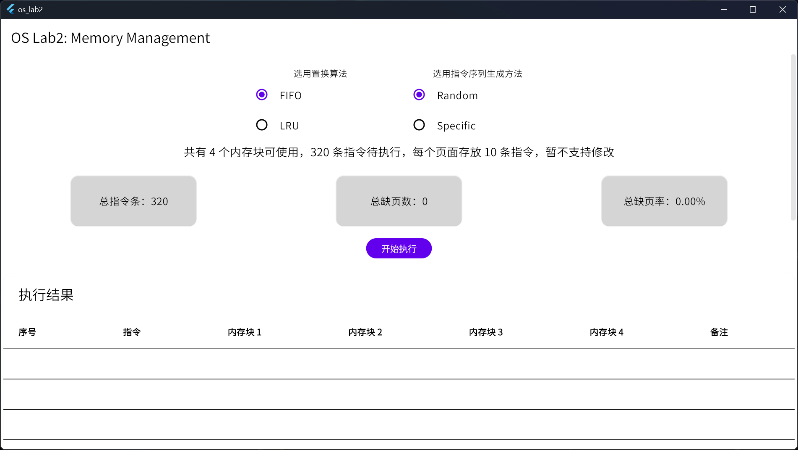

# 请求调页存储管理方式模拟

项目同步放在 [GitHub](https://github.com/meoowny/memory_management) 上。

## 项目目的

通过本次项目实践，希望能够加深对于页面、页表及地址转换的理解，熟悉页面置换过程，也加深对于请求调页系统的原理和实现过程的理解。

## 项目需求

- 基本任务：假设每个页面可存放 10 条指令，分配给一个作业的内存块为 4。模拟一个作业的执行过程，该作业有 320 条指令，即它的地址空间为 32 页，目前所有页还没有调入内存。
- 模拟过程中，如果所访问指令在内存中，则显示其物理地址，并转到下一条指令；如果没有在内存中，则发生缺页，此时需要记录缺页次数，并将其调入内存。如果 4 个内存块中已装入作业，则需要进行页面置换。所有 320 条指令执行完成后，计算并显示作业执行过程中发生的缺页率。
- 指令访问次序：要求 50% 的指令是顺序执行的，25% 是均匀分布在前地址部分，25% 是均匀分布在后地址部分。程序中提供了两种指令序列的生成方式：
    - Random：按概率生成指令序列，生成下一条指令时 50% 的概率会顺序生成，25% 的概率在前地址部分中随机生成，25% 的概率在后地址部分中随机生成；
    - Sequential：
        1. 在第 0~319 条指令之间随机选择一条起始执行指令，序号记为 m；
        2. 顺序执行下一条指令，即序号为 m+1 的指令；
        3. 通过随机数跳转到前地址部分 0~m-1 中的某个指令处，序号记为 m1；
        4. 顺序执行下一条指令，即序号为 m1+1 的指令；
        5. 通过随机数跳转到后地址部分 m1+2~319 中的某个指令处，序号记为 m2；
        6. 顺序执行下一条指令，即序号为 m2+1 的指令；
        7. 重复步骤 3~5 直到执行完 320 条指令。
- 置换算法：
    - FIFO：实现较为简单，但性能较差，容易产生抖动现象；
    - LRU：是局部性原理的合理近似，性能接近最佳算法，但需要另外记录页面使用时间的先后关系（本次项目中使用双向队列存储）。

## 开发环境

- 操作系统：Windows
- 开发语言：Rust（逻辑实现）、Dart（结果显示）
- GUI 框架：Flutter
- FFI 交互代码生成工具：`flutter_rust_bridge_codegen`

## 项目结构介绍

- `lib/`：Flutter 界面代码，用于运行结果数据的呈现；
- `rust_ffi/src/`：算法逻辑实现代码，用于模拟作业执行时请求调页的相关过程；
    - `rust_ffi/src/api.rs`：Rust 与 Flutter 交互的部分，用于接收作业执行参数（置换算法与执行顺序生成方式）并返回作业执行结果；
    - `rust_ffi/src/api/memory_manager.rs`：存储管理模拟；
    - `rust_ffi/src/api/scheduler.rs`：置换算法实现；
    - `rust_ffi/src/api/pages.rs`：一个简单的页的模拟与指令执行顺序生成函数。
其余为平台相关代码和 FFI 交互相关代码。

## 运行方式

提交至学院服务器的项目中包含打包好的 Windows 可执行文件与 Android 安装包，可自选运行方式。

## 项目架构与算法实现

前端部分略，主要用于执行结果的数据呈现。通过 `generateReplacementRecord` 函数（见 `lib/ffi/native_ffi.dart` 的 `NativeFun` 类）与 Rust 代码进行交互，完成算法选择与结果接收。

### 内存管理器 MemoryManager

负责作业执行过程中的地址转换与页面置换工作，主要结构体主要包含了置换算法实现 trait、提供的内存块数量、页表、页存储的指令条数、缺页数、已执行指令条数：

```rust
pub struct MemoryManager {
    scheduler: Box<dyn scheduler::Scheduler>,
    blocks: Vec<Option<pages::Page>>,
    page_table: Vec<pages::Page>,
    page_size: usize,
    fault_counter: usize,
    instrument_counter: usize,
}
```

通过 `step` 函数模拟单条指令的执行，接收当前指令地址，返回指令执行情况（当前内存块内容、是否缺页）。

### 置换算法实现 Scheduler

提供一个 `Scheduler` trait 定义了置换算法需要实现的函数：`check` 函数和 `reset` 函数，`check` 函数检查是否缺页，缺页的话返回需要调出页的所在内存块的块号：

```rust
pub trait Scheduler {
    fn check(
        &mut self,
        new_page_id: usize,
        blocks: &Vec<Option<pages::Page>>,
        page_table: &Vec<pages::Page>,
    ) -> Result<usize, Fault>;
    fn reset(&mut self);
}
```

#### FIFO 置换算法

先进先出置换算法，在每次选择需要调出的页面时选择最早调入内存的页面。

结构体使用一个变量 `oldest_block_id` 存储当前内存块中最早调入内存的页面的页号。若发生缺页则调出最早调入的页，并更新 `oldest_block_id`。

```rust
pub struct FIFOScheduler {
    capacity: usize,
    oldest_block_id: usize,
}
```

#### LRU 置换算法

最近最久未使用算法，在每次选择调出的页面时选择最近最久未使用的页面。

结构体使用一个双向队列 `current_pages` 存储最近使用的页面。实现逻辑如下：
- 若当前指令在内存中，则将队列中的⻚号删去重新压入队列头部；
- 若当前指令不在内存中（发生缺页），但内存尚有空闲，直接将指令所在页的页号压入队列头部；
- 若当前指令不在内存中（发生缺页）且内存无空闲块，则弹出队列尾部页号并压入当前指令所在页的页号，弹出页所在块的块号返回给 `MemoryManager` 用以调出内存。

```rust
pub struct LRUScheduler {
    capacity: usize,
    current_pages: VecDeque<usize>,
}
```

## 运行截图




